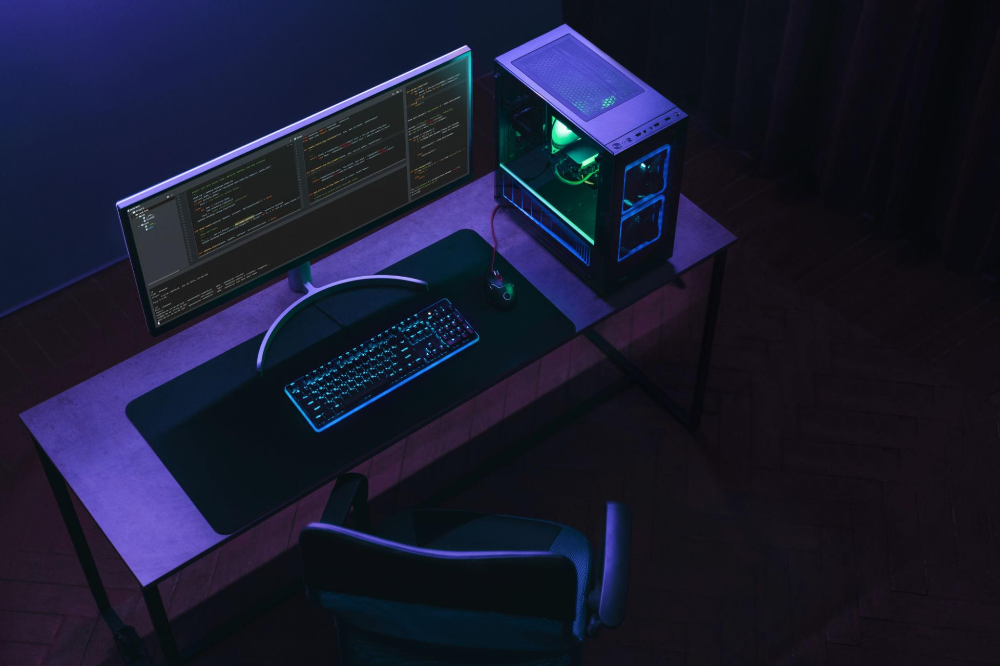

# Hi, I'm Unal Dutlu

### Frontend Developer | Lifelong Learner | Team Player

## About Me

- I build modern, responsive, and user-friendly web interfaces.
- I enjoy learning new technologies and applying them to real projects.
- I value collaboration, ownership, and consistent improvement.
- I am open to impactful frontend roles and collaborations.

## Tech Stack

  

## Current Focus

- Building production-ready frontend projects with React.
- Deepening JavaScript, TypeScript, and Redux architecture skills.
- Writing cleaner, maintainable UI code with strong component structure.

## GitHub Analytics

  
  

  

## Connect With Me

  
  

  

